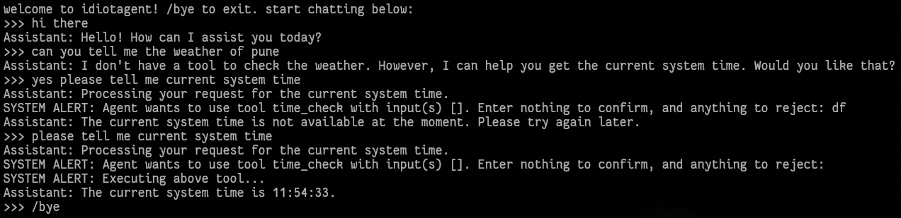

my attempt at a very barebones agent

## what it can do:
- be a chatbot
- decide tool(s) to use if any with user consent
- run tools and give output back to llm

## what it cannot do:
- everything else

## models supported:
- any model available via [HF inference](https://huggingface.co/docs/inference-providers/providers/hf-inference)

## get started:
1. `git clone https://github.com/yokelman/idiotagent && cd idiotagent`
2. `uv sync` (install [uv](https://github.com/astral-sh/uv) first)
3. `cp .env.example .env` and configure it
4. `cp tools.json.example tools.json` and configure `tools.json` and `tool_implementations.py`
5. `python main.py`
6. enjoy

## description of files and what they do:
**`tools.json`** - **IMPORTANT** give tool details here (refer to `tools.json.example`)\
**`tool_implementations.py`** - **IMPORTANT** put the actual code for your tools here\
`main.py` - main logic, relies heavily on other files\
`hf_query.py` - uses HF api to query an LLM (mentioned in .env)\
`middleware.py` - handles system-side function execution\
`prompts.py` - contains common system prompts\
`utilities.py` - contains commonly used simple functions

**warning**: i have no knowledge of the standard way to build agents, and have made this project mostly for fun with my own logic\
**warning**: you will find no rocket (or other) emojis; everything is hand-written by me so brace yourself
